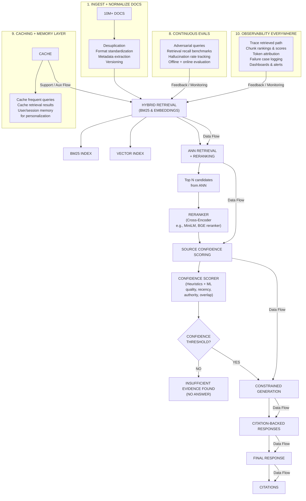

```mermaid
    flowchart TD
    subgraph step1["1. INGEST + NORMALIZE DOCS"]
        A["10M+ DOCS"] --> B["Desuplication<br/>Format standardization<br/>Metadata extraction<br/>Versioning"]
    end
    B --> C["HYBRID RETRIEVAL<br/>(BM25 & EMBEDDINGS)"]
    C --> D["BM25 INDEX"]
    C --> E["VECTOR INDEX"]
    C --> F["ANN RETRIEVAL<br/>+ RERANKING"]
    F --> G["Top N candidates<br/>from ANN"]
    G --> H["RERANKER<br/>(Cross-Encoder<br/>e.g., MiniLM, BGE reranker)"]
    H --> I["SOURCE CONFIDENCE SCORING"]
    I --> J["CONFIDENCE SCORER<br/>(Heuristics + ML<br/>quality, recency,<br/>authority, overlap)"]
    J --> K{CONFIDENCE<br/>THRESHOLD?}
    K -->|NO| L["INSUFFICIENT EVIDENCE FOUND<br/>(NO ANSWER)"]
    K -->|YES| M["CONSTRAINED GENERATION"]
    M --> N["CITATION-BACKED RESPONSES"]
    N --> O["FINAL RESPONSE"]
    O --> P["CITATIONS"]
    subgraph step8["8. CONTINUOUS EVALS"]
        Q["Adversarial queries<br/>Retrieval recall benchmarks<br/>Hallucination rate tracking<br/>Offline + online evaluation"]
    end
    subgraph step9["9. CACHING + MEMORY LAYER"]
        R["CACHE"]
        R --> S["Cache frequent queries<br/>Cache retrieval results<br/>User/session memory<br/>for personalization"]
    end
    subgraph step10["10. OBSERVABILITY EVERYWHERE"]
        T["Trace retrieved path<br/>Chunk rankings & scores<br/>Token attribution<br/>Failure case logging<br/>Dashboards & alerts"]
    end
    C -->|Data Flow| F
    F -->|Data Flow| I
    I -->|Data Flow| M
    M -->|Data Flow| N
    N -->|Data Flow| O
    O -->|Data Flow| P
    Q -->|Feedback / Monitoring| C
    R -->|Support / Aux Flow| C
    T -->|Feedback / Monitoring| C
```